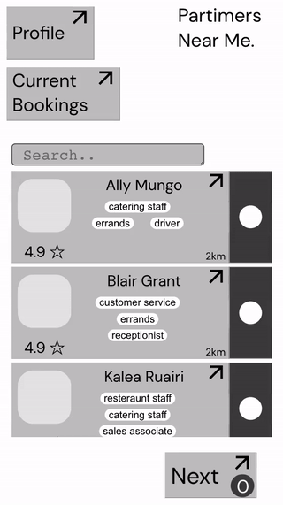
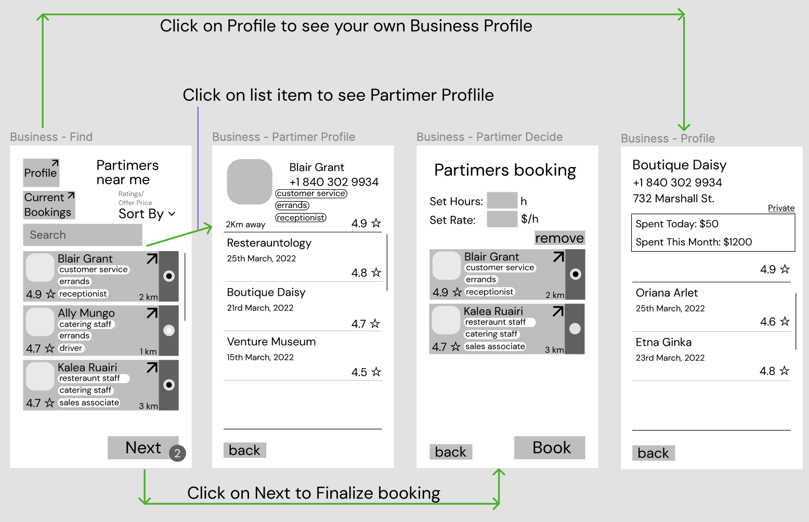
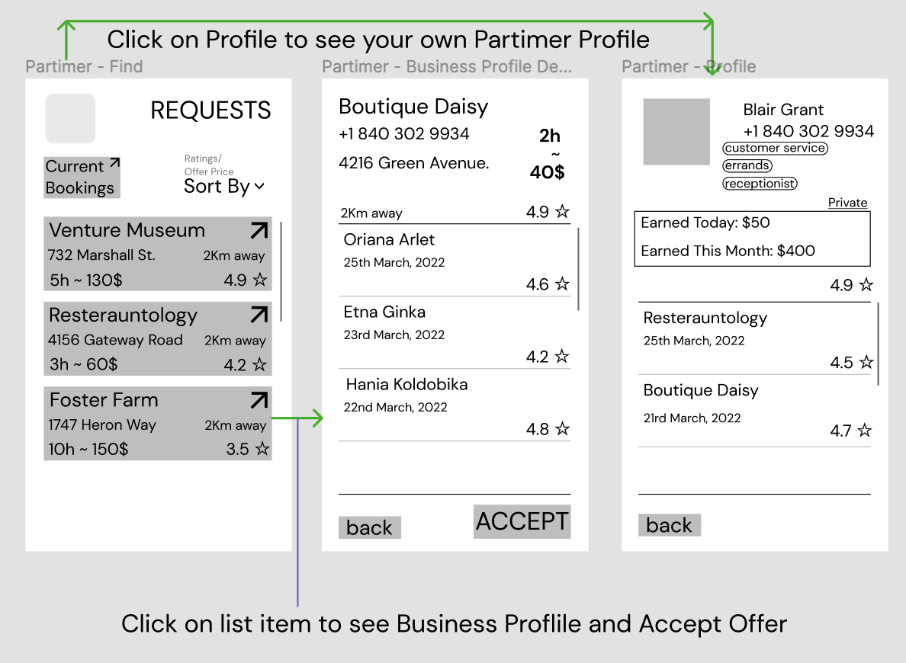

# partimer-app
## 3rd place, Hacking Mount Pearl 2022 (Business Recovery) (NL, Canada)  
Finding good part-time workers for a business can be difficult.  
Businesses face ghosting, rush hours and employees calling in sick.  
Job seekers want extra income, flexibility and control of their schedule.  
Our solution to business recovery post covid is app that offers  
on-demand talent, flexible work schedules, guaranteed payment,  
ratings and reviews to assess available candidates near a business  
and how well a business treats its employees.  
Incorporating the Uber and Tinder model as part of  
external employees available feature to an internal employees schedule manager.  
Team of 3, where I first worked on UX UI design on Figma,  
then the development of frontend React,  
backend NodeJS Express on AWS Lambda, NoSQL database MongoDB.  
 
  
# Business Screens
  
# Partimer Screens
  

